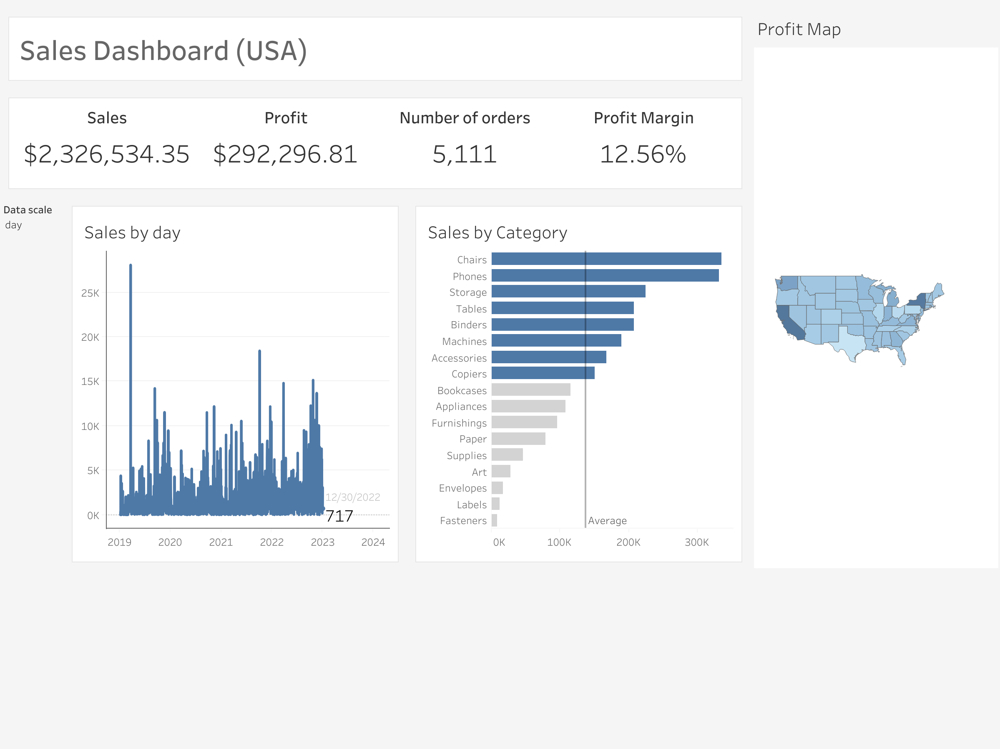

# Sales Dashboard (USA) — Tableau

Интерактивный дашборд для анализа продаж в США, созданный в Tableau на основе датасета Superstore.  
Проект демонстрирует работу с KPI, временными рядами, параметрами, категорийным анализом и географической картой.



---

## 🎯 Цель проекта

Создать компактный и информативный BI-дэшборд уровня junior/middle, показывающий навыки:
- работы с Tableau Public и Tableau Desktop,
- построения чистой структуры дашборда,
- использования параметров (dynamic date scale),
- создания расчётных полей,
- географической визуализации (Profit Map),
- грамотной визуализации KPI и категорий.

---

## 📊 Состав дашборда

### **1. KPI-панель**
Отображает ключевые метрики:
- **Sales** — суммарные продажи  
- **Profit** — прибыль  
- **Number of orders** — количество заказов  
- **Profit Margin** — маржинальность  
  > Формула: `SUM([Profit]) / SUM([Sales])`

---

### **2. Sales over time (динамика продаж)**

Линейный график, масштаб которого управляется параметром **Data scale** (`day`, `week`, `month`).

**Используемое расчётное поле:**
```tableau
DATE(DATETRUNC([Data scale], [Order Date]))
````

Преимущества:

* единый график вместо трёх отдельных,
* динамическая смена масштаба времени,
* компактная и понятная архитектура дашборда.

---

### **3. Sales by Category**

Горизонтальная диаграмма продаж по категориям с:

* сортировкой по убыванию,
* выделением категорий выше среднего,
* вертикальной линией *Average*,
* акцентной цветовой палитрой.

---

### **4. Profit Map (геокарта США)**

Географическая карта, показывающая прибыль по штатам.
Использует:

* `State` — географическое поле,
* `Profit` — цветовую заливку.

Помогает определить:

* наиболее прибыльные штаты,
* зоны низкой прибыльности,
* региональные паттерны.

---

## 🗂 Используемый датасет

**Sample – Superstore**

Основные поля:

* Order Date
* Sales
* Profit
* Order ID
* Category
* State
* Segment
* Region / Market

---

## 🔧 Технологии

* Tableau Desktop Public Edition
* Tableau Public
* Calculated Fields
* Parameters
* Git + GitHub

---

## 🖥 Live Dashboard

👉 **Tableau Public:**
[https://public.tableau.com/views/SalesDashboardUSA_17633147981230/SalesDashboardUSA?:language=en-US&:sid=&:redirect=auth&:display_count=n&:origin=viz_share_link](https://public.tableau.com/views/SalesDashboardUSA_17633147981230/SalesDashboardUSA?:language=en-US&:sid=&:redirect=auth&:display_count=n&:origin=viz_share_link)